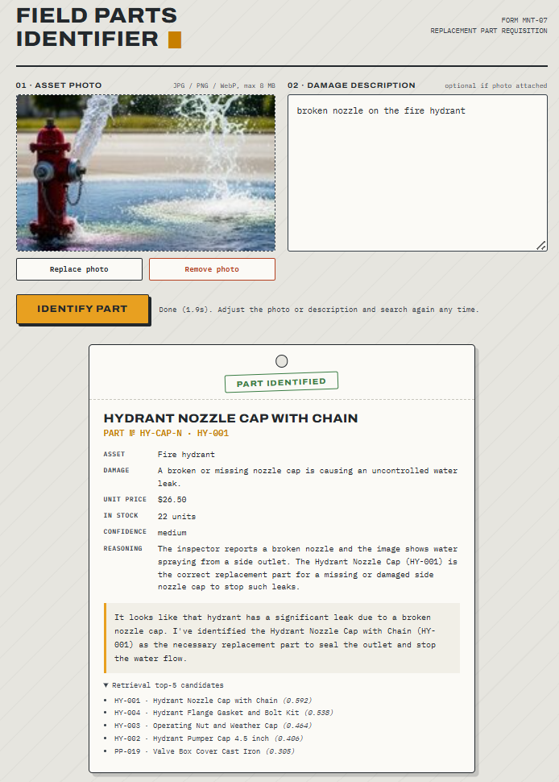
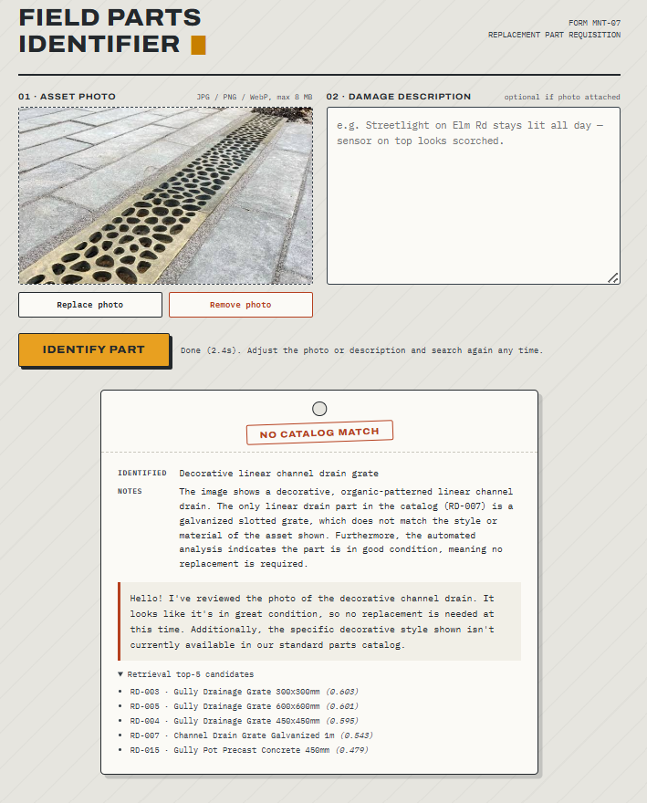

# Field Parts Identifier — Multimodal RAG (FastAPI + Cerebras)

Field-inspection tool: upload a photo of a damaged street asset and/or a short
damage description, and the system identifies the correct replacement part
from a 132-part catalog spanning 19 asset categories (traffic signals,
streetlights, piping, hydrants, drainage, signage, street furniture, fencing,
electrical cabinets, EV chargers...).

## Architecture
```
photo ──> [1] Cerebras gemma-4-31b vision caption ─┐
                                                   ├─> [2] sentence-transformer
description ───────────────────────────────────────┘      embedding (local, CPU)
                                                              │
                        [3] cosine top-5 retrieval (NumPy, in-memory)
                                                              │
                        [4] Cerebras identification over candidates only
                            (strict JSON contract, hallucinated IDs rejected)
```
Everything except the two Cerebras calls runs locally and free: embeddings via
`all-MiniLM-L6-v2` on CPU (~80MB one-time download), vector search in NumPy,
embedding cache on disk for instant restarts. No paid vector DB or services.

## Results

Measured on the included 50-query evaluation set (see `eval/`):

- Retrieval: 98% top-1, 100% top-5 accuracy, 16.6ms median latency
- End-to-end (retrieval + LLM identification): 100% accuracy on
  48 evaluated queries, 675ms median latency
- Reproduce with `uv run python eval/run_eval.py` (add `--full`
  for the end-to-end run, ~50 API calls)

## Demo

**Multimodal match** — the model combines the inspector's note with
visual evidence (water spraying from the side outlet) to identify
the correct part:



**Calibrated rejection** — retrieval surfaces relevant drainage
candidates, but the system declines: wrong style/material, and the
asset shows no damage:



## Setup (one time, uses uv)
```bash
uv sync                     # installs FastAPI, sentence-transformers, etc.
cp .env.example .env        # Windows: copy .env.example .env
```
Paste your Cerebras API key into `.env` after `CEREBRAS_API_KEY=`
(no quotes, no spaces around `=`).

## Run
```bash
uv run python app.py
```
Open http://127.0.0.1:8000 — stop with Ctrl+C.
First launch downloads the embedding model and builds the index (a minute or
two); every launch after that loads from cache in under a second.

## Evaluate
```bash
uv run python eval/run_eval.py           # retrieval accuracy, free, no API
uv run python eval/run_eval.py --full    # + end-to-end LLM accuracy (~50 API calls)
```
Reports top-1/top-3/top-5 retrieval accuracy over 50 labeled field-report
queries, median retrieval latency, and (with --full) final identification
accuracy and median end-to-end latency.

## Project layout
```
parts-identifier/
├── app.py                    # FastAPI backend, 4-stage pipeline, Pydantic models
├── retrieval.py              # local embedding index + cosine top-k
├── data/
│   ├── parts_catalog.json    # 132-part catalog (generated)
│   └── generate_catalog.py   # deterministic catalog generator
├── eval/
│   ├── testcases.json        # 50 labeled test queries
│   └── run_eval.py           # accuracy + latency harness
├── templates/index.html      # single-page UI
├── pyproject.toml            # uv-managed dependencies
└── .env.example              # copy to .env, add key
```

## Notes
- Photo, description, or both — at least one is required.
- The UI shows total latency per request and the retrieval top-5 with scores.
- Non-catalog subjects return a clear "no catalog match" reply; the server
  rejects any part ID outside the retrieved candidates.
- `/health` endpoint reports catalog size and model.
- Regenerate/extend the catalog: edit `data/generate_catalog.py`, run it,
  restart (the embedding cache auto-invalidates via catalog hash).
